# CMPE 172 - Lab #2 Notes

##Spring MVC Project - Serving Web Content with Spring MVC

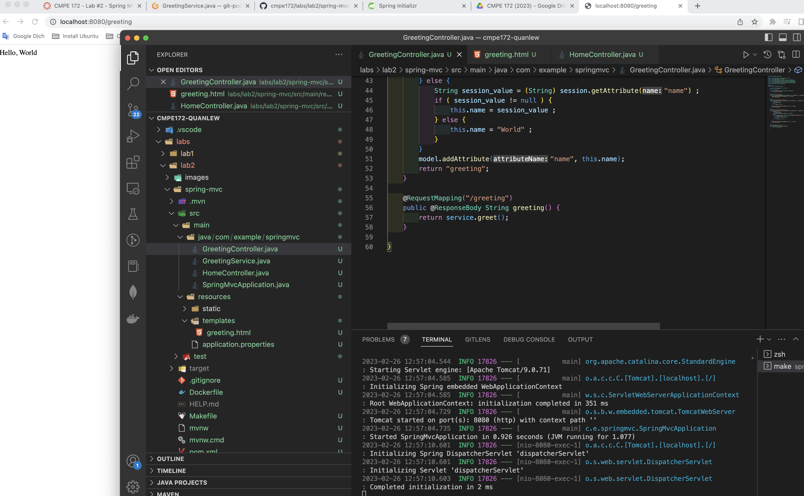
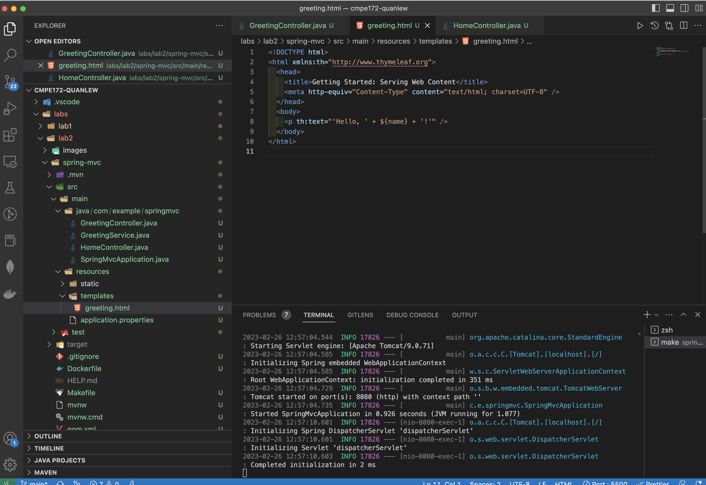
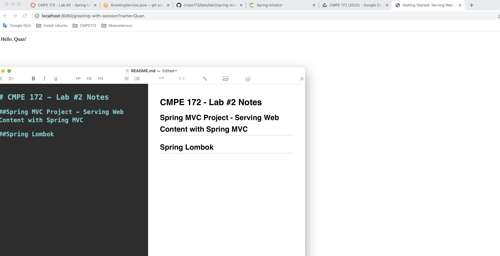

##Spring Lombok

###- FieldLevelGetterSetterDemo.java
####a.

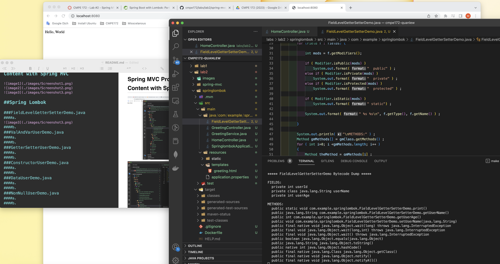

+Annotation is @Setter And @Getter  

+Fields are applied for these Lombok such as userName and userAge. Otherwise, userId is not applied.

####b. Lambok Anotation for this class: 

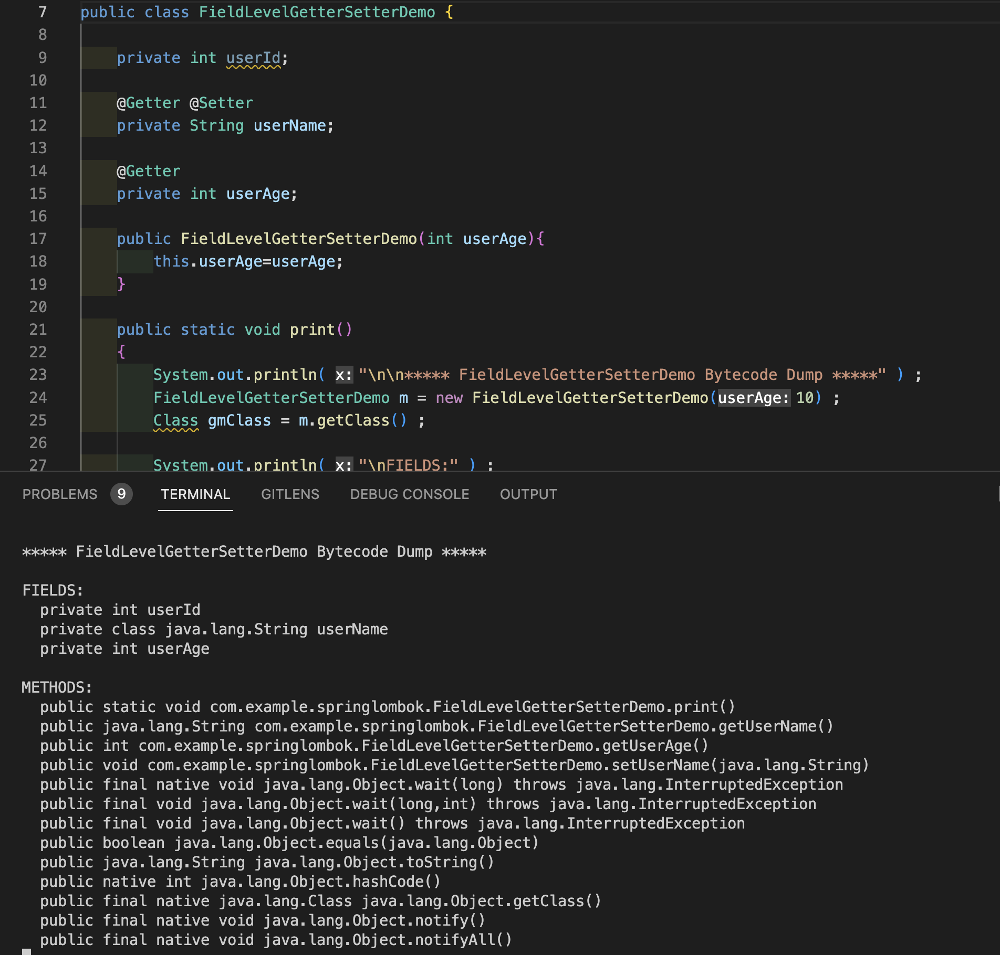

+As the picture, the fields userAge (@Getter) and userName (@Getter and @Setter) have annotation. So the method will automatically generate and see the output in terminal  
 (public java.lang.String com.example.springlombok.FieldLevelGetterSetterDemo.getUserName()  
  public int com.example.springlombok.FieldLevelGetterSetterDemo.getUserAge()  
  public void com.example.springlombok.FieldLevelGetterSetterDemo.setUserName(java.lang.String)).
  
+Besides, the field userId doesn’t have annotation. Therefore, output won’t generate in terminal 

###ValAndVarUserDemo.java
####a.

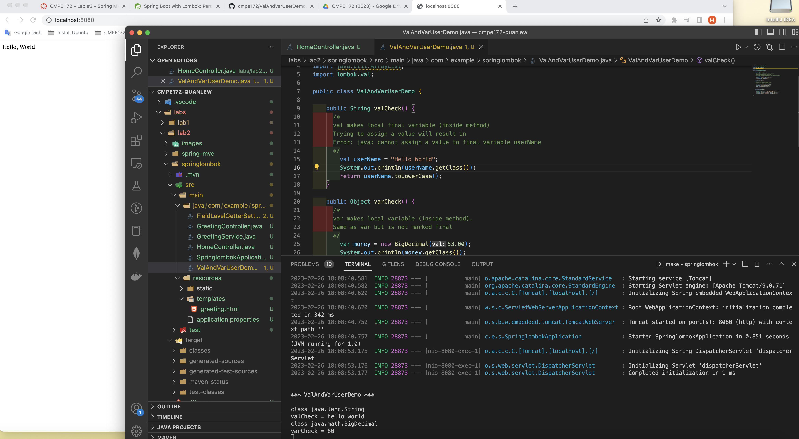

+Annotation is local variable  

+Local variable are applied for these Lombok such as valCheck() and varCheck().

####b.

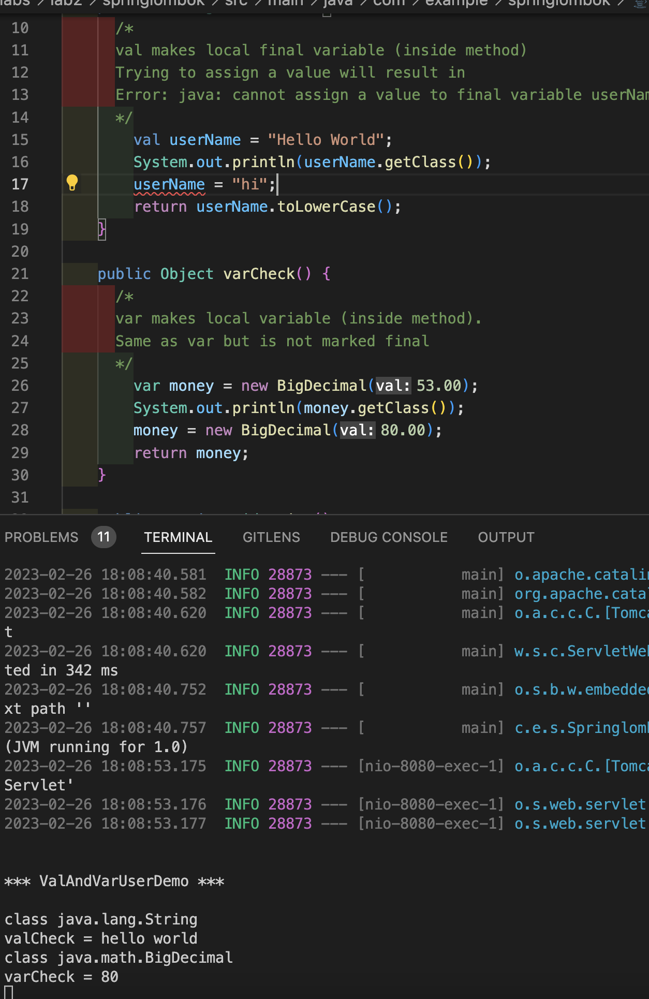

+In valCheck() method, constant userName is declared by val that it attempt to assign another value, but it get error. 
+In varCheck() method, constant money is declared by var that it can assign another value without error.

###GetterSetterUserDemo.java
####a.
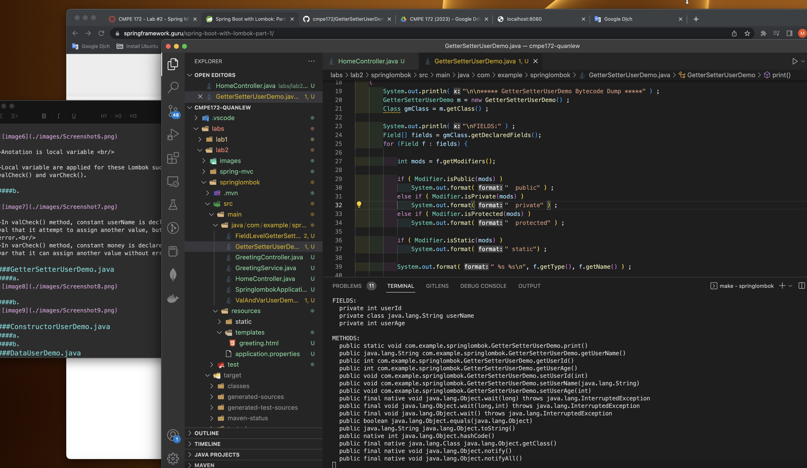

+Anotation is @Getter and Setter  

+These annotation are declared at top level class. So all the fields will be applied for such as userId, userName, and userAge

####b.
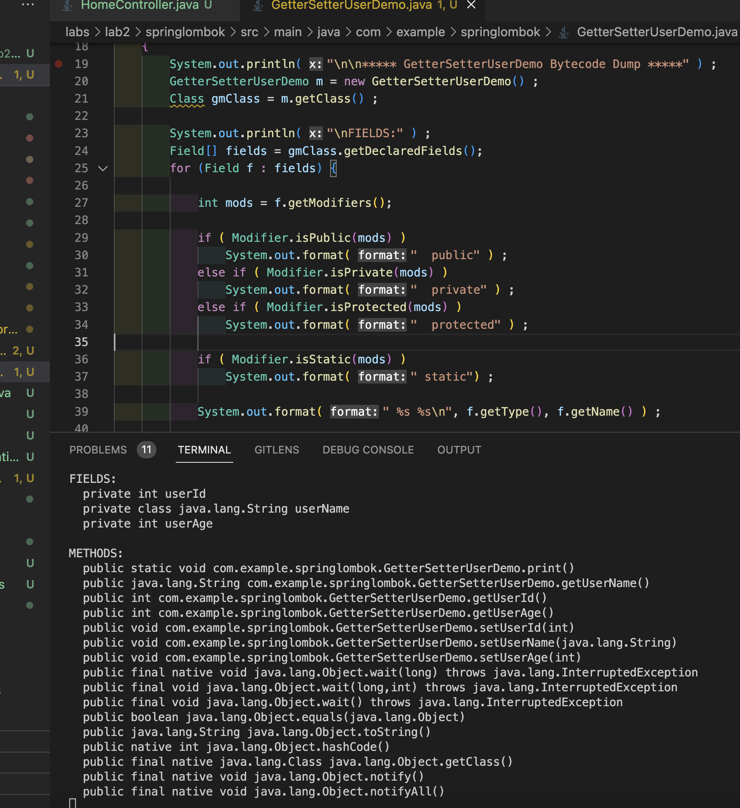

+As the result, the fields userId, userAge, and userName have getter and setter method. So they will automatically generate and see the output in terminal. (public java.lang.String com.example.springlombok.GetterSetterUserDemo.getUserName()
  public int com.example.springlombok.GetterSetterUserDemo.getUserId()
  public int com.example.springlombok.GetterSetterUserDemo.getUserAge()
  public void com.example.springlombok.GetterSetterUserDemo.setUserId(int)
  public void com.example.springlombok.GetterSetterUserDemo.setUserName(java.lang.String)
  public void com.example.springlombok.GetterSetterUserDemo.setUserAge(int))

###ConstructorUserDemo.java
####a.

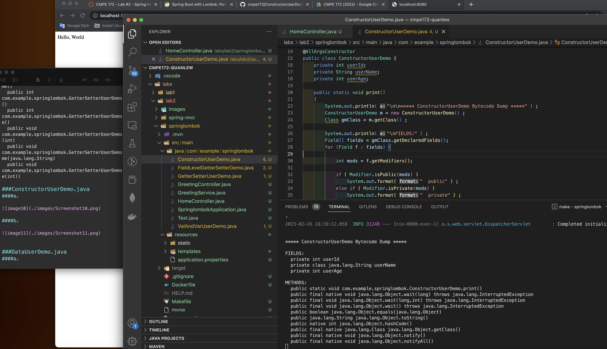

+Annotation is @AllArgsConstructor  

+The constructor is created with all parameters which the fields is declared such as userId, userName, and userAge

####b.

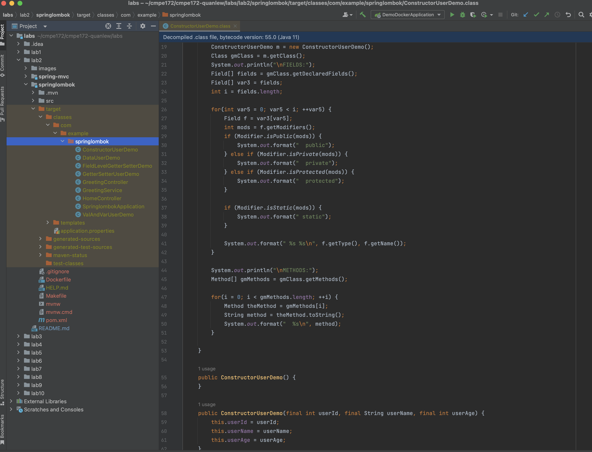

+In that case, they will be tested with org.junit libs to assert a constructor which exist enough parameters, or decompile file .class to check.  
+As the picture, the constructor ConstructorUserDemo(final int userId, final String userName, final int userAge) contain all the fields which become all the parameters

###DataUserDemo.java
####a.

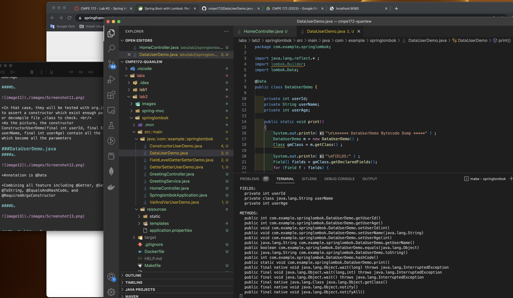

+Annotation is @Data

+Combining all feature including @Getter, @Setter, @ToString, @EqualsAndHashCode, @NoArgsConstructor, and @RequiredArgsConstructor

####b.

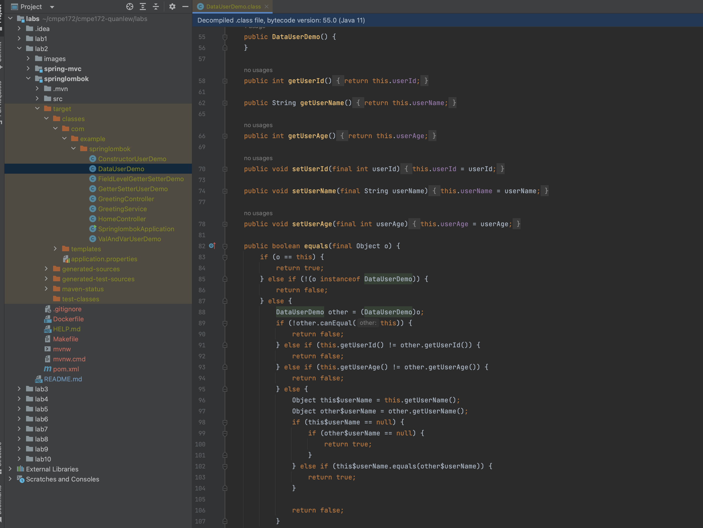
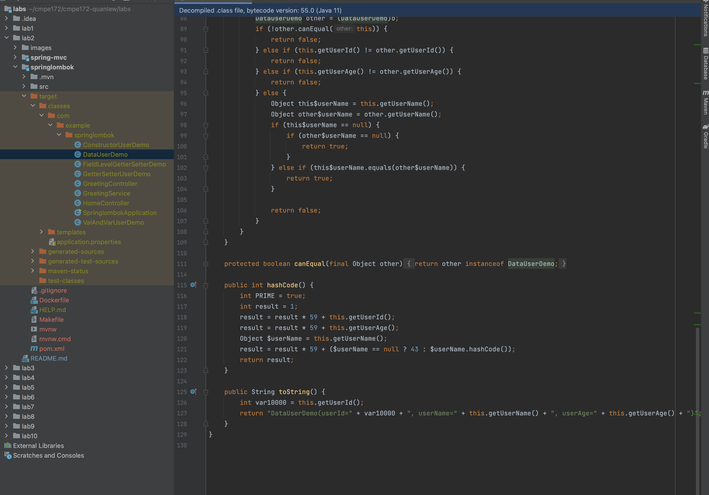

+To verify output, it will be decompiled. And check all feature as the pictures

###NonNullUserDemo.java
####a.

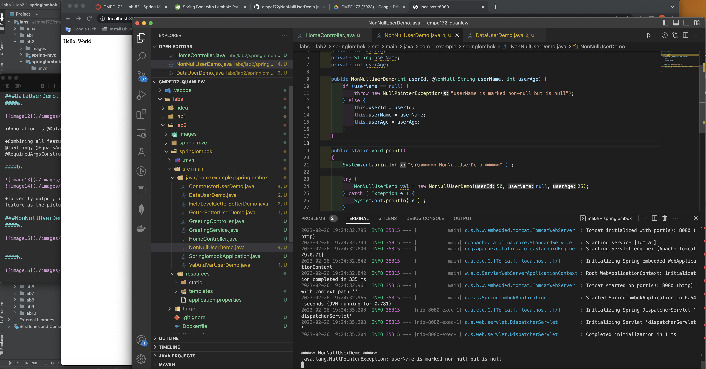

+Annotation is @NonNull

+They used for check parameter and throw exception if it is null.

+The variable applied in the case is userName

####b.

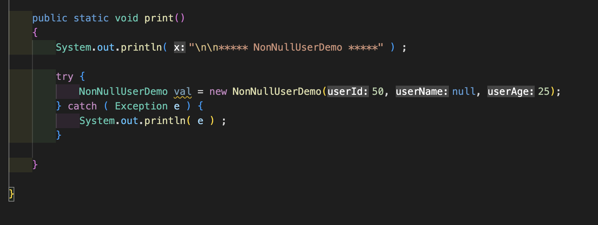

+As the result, userName is declared with @NotNull. But in this case, it == null and throw java.lang.NullPointerException: userName is marked non-null but is null
