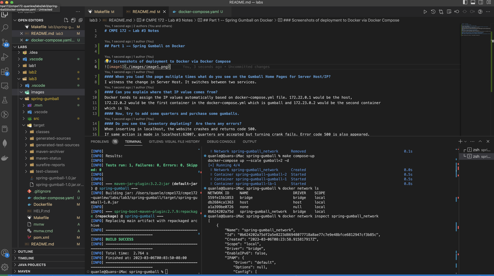
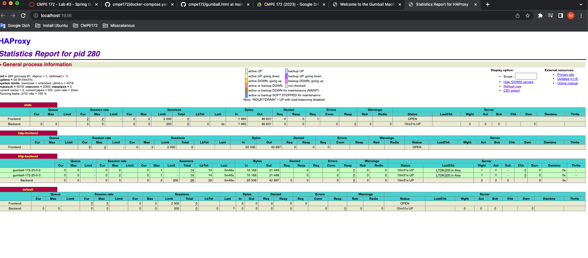
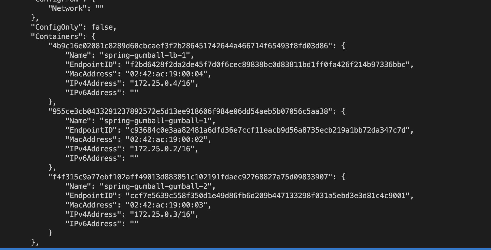
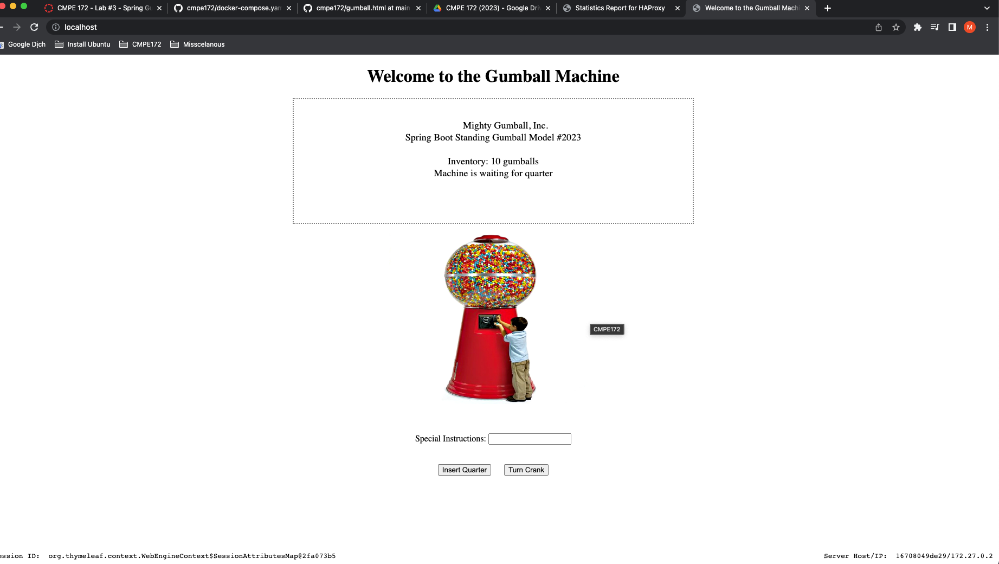
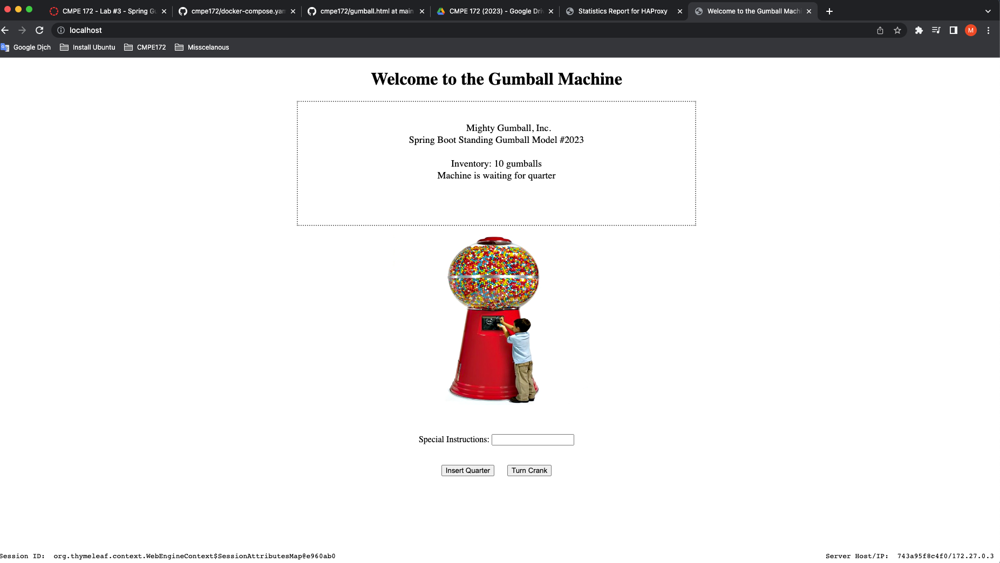
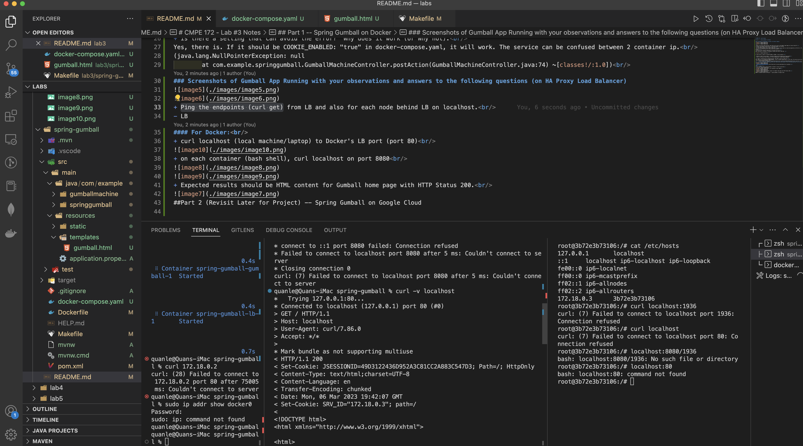
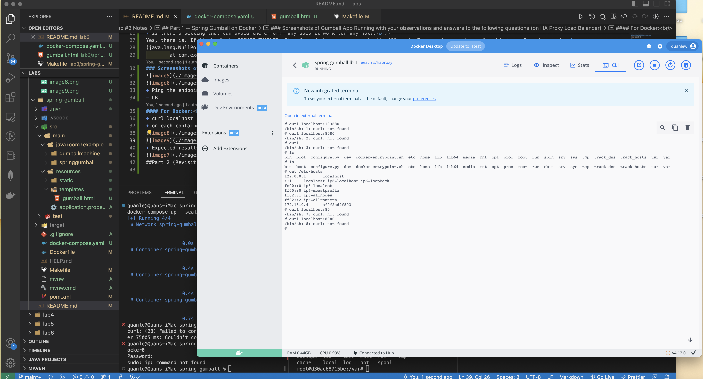
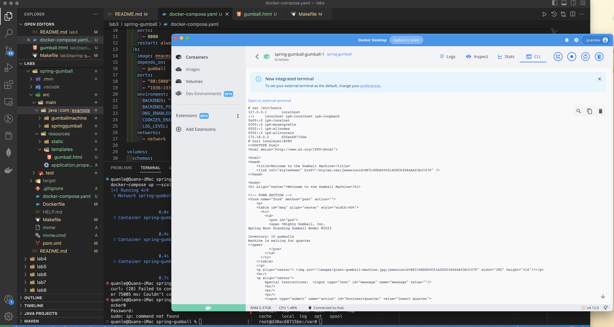
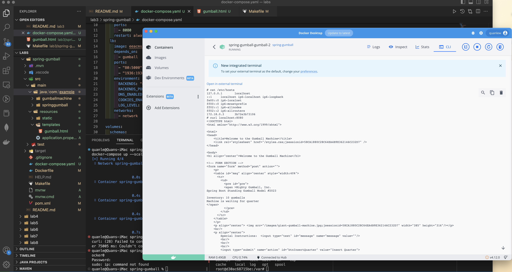
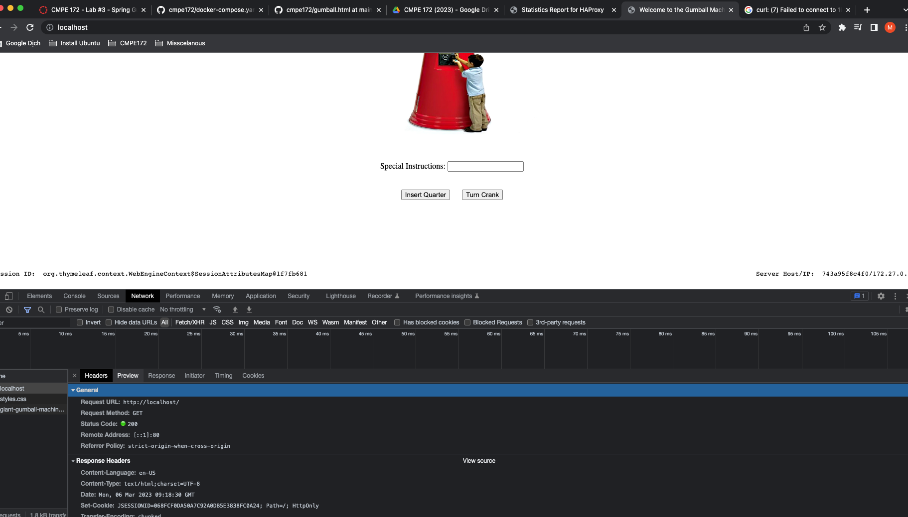

# CMPE 172 - Lab #3 Notes

## Part 1 -- Spring Gumball on Docker

### Screenshots of deployment to Docker via Docker Compose

 

- When you load the page multiple times what do you see on the Gumball Home Pages for Server Host/IP?  
  I witness the change in Server Host. It switches between two services.
- Can you explain where that IP value comes from?  
- It come from container id. We have 3 container id (server host) where ip create and generate ip 172.25.0.2, 172.25.0.3 
- Now, try to add some quarters and purchase some gumballs.  
  Pressed!  
- Do you see the inventory depleting? Are there any errors? 
  When inserting in localhost, the website crashes and returns code 500.  

  

If same action is made in localhost:52955 or 52960, it work normally. 

- Review to code for your answer. No need to make any code changes to fix any issue 
- Look at the Session State Feature of the HA Loadbalancer (using COOKIES_ENABLED)

- Is there a setting that can avoid the error? Why does it work (or Why not). 
  Yes, there is. If it should be COOKIE_ENABLED: "true" in docker-compose.yaml, it will work. The service can be confused between 2 container ip. 
  (java.lang.NullPointerException: null
  at com.example.springgumball.GumballMachineController.postAction(GumballMachineController.java:74) ~[classes!/:1.0]) 

### Screenshots of Gumball App Running with your observations and answers to the following questions (on HA Proxy Load Balancer)

- Ping the endpoints (curl get) from LB and also for each node behind LB on localhost. 

  

#### For Docker: 

- curl localhost (local machine/laptop) to Docker's LB port (port 80) 
  
- on each container (bash shell), curl localhost on port 8080 
  
  
- Expected results should be HTML content for Gumball home page with HTTP Status 200. 
  
  ##Part 2 (Revisit Later for Project) -- Spring Gumball on Google Cloud
