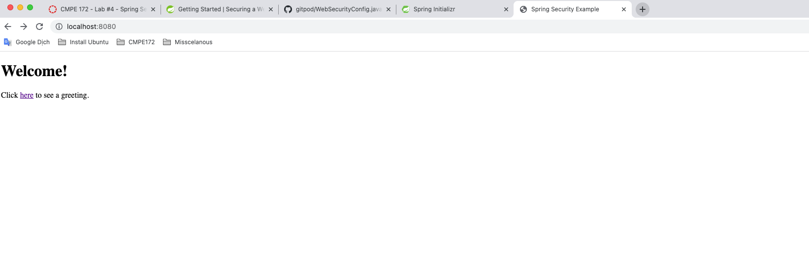
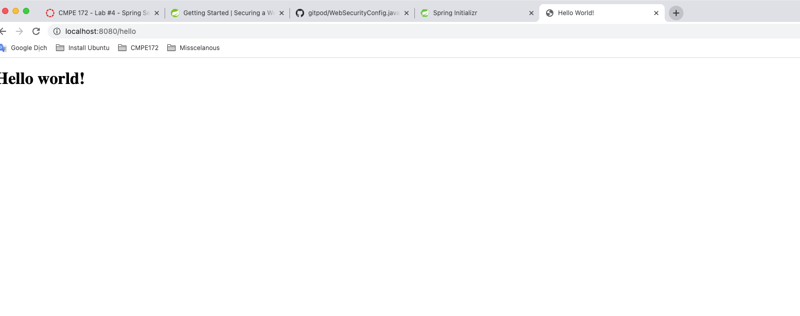
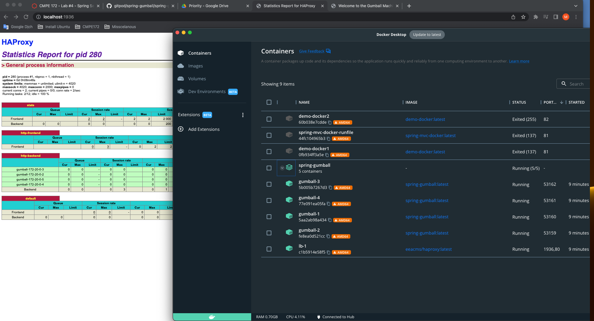
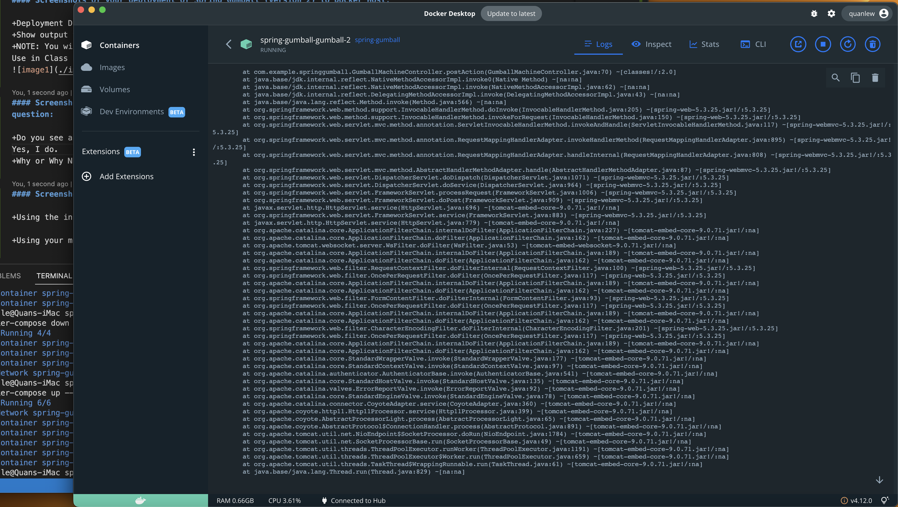
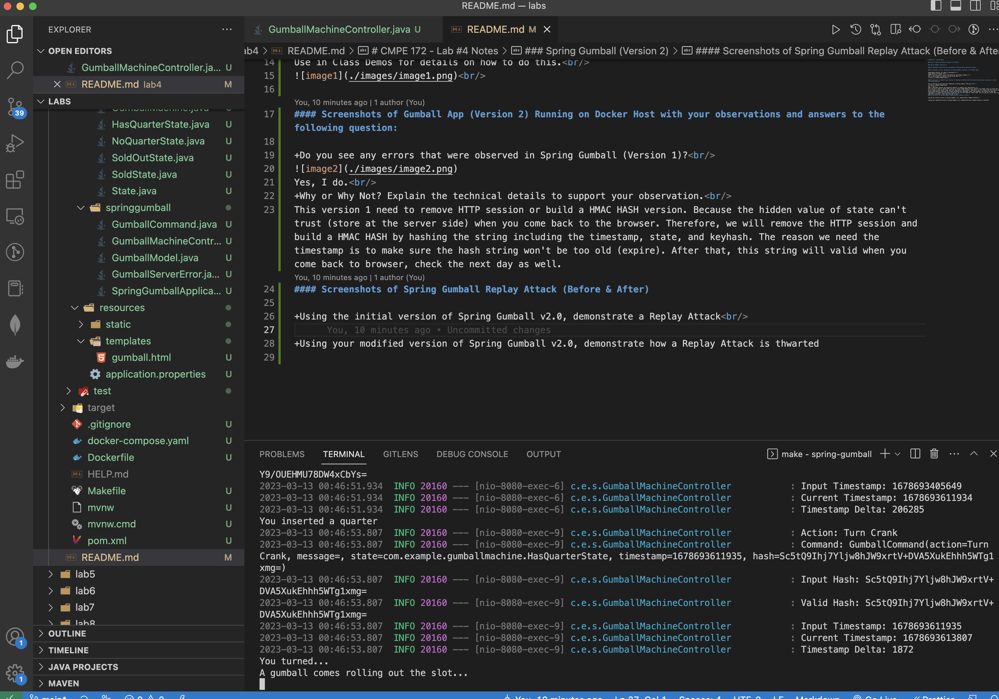
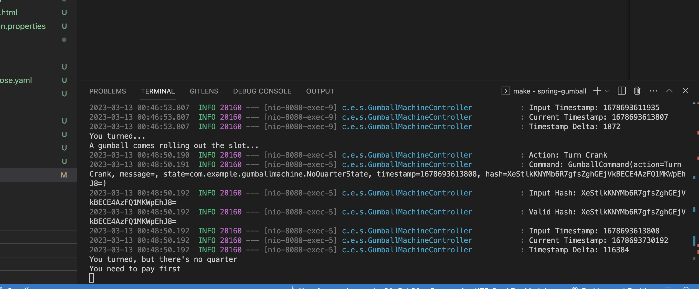
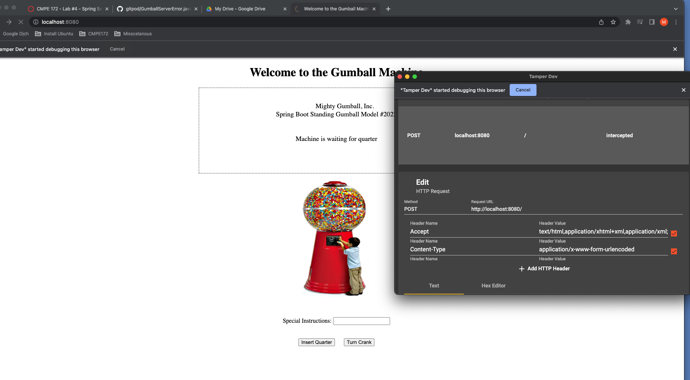
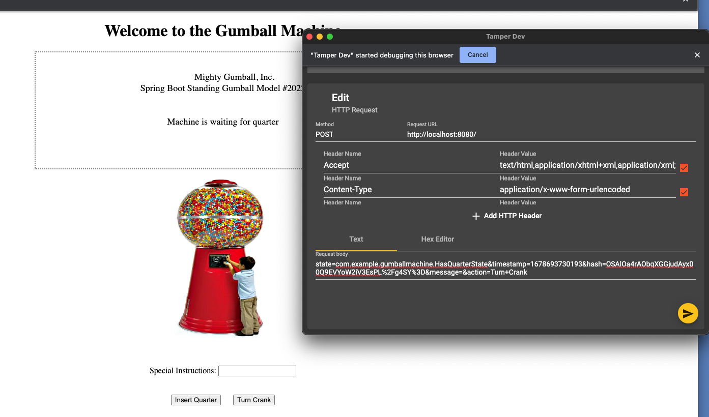
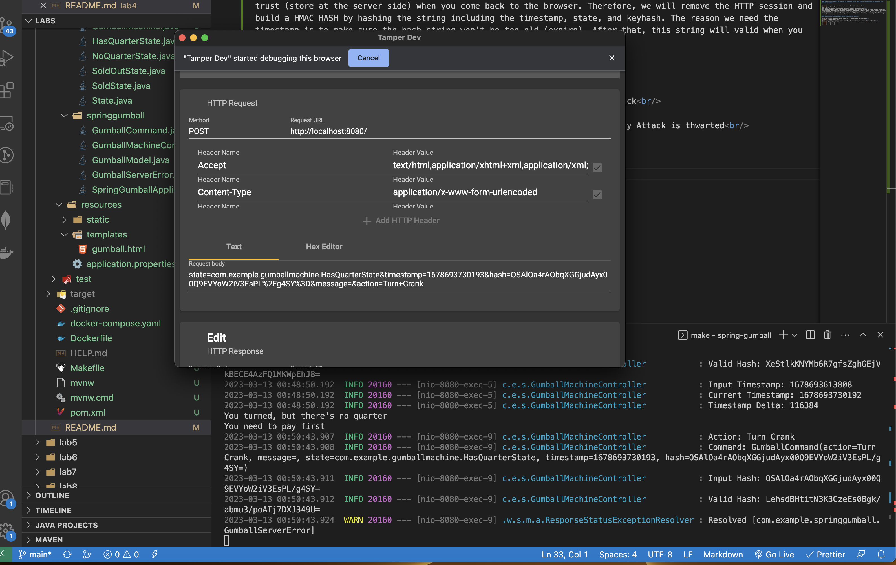

# CMPE 172 - Lab #4 Notes

### Start a Spring Initializr Project in IntelliJ

#### Screenshots and Discussion confirming a working Spring Security project.

+Before applying security to a web application, we will have a unsecurity web that you can see homepage view from controller.
 

Besides, we can not click "here" hypertext as above images. If you try to login, you will transfer to login page view.  
 

+After applying security, we will see hello page view after logining successfully.
 
 

### Spring Gumball (Version 2)

#### Screenshots of your deployment of Spring Gumball (Version 2) to Docker Host:

+Deployment Details (at least 4 Containers) 
+Show output via Docker PS 
+NOTE: You will need to use a Load Balancer and Docker Compose. 
Use in Class Demos for details on how to do this. 
 

#### Screenshots of Gumball App (Version 2) Running on Docker Host with your observations and answers to the following question:

+Do you see any errors that were observed in Spring Gumball (Version 1)? 

Yes, I do. 
+Why or Why Not? Explain the technical details to support your observation. 
This version 1 need to remove HTTP session or build a HMAC HASH version. Because the hidden value of state can't trust (store at the server side) when you come back to the browser. Therefore, we will remove the HTTP session and build a HMAC HASH by hashing the string including the timestamp, state, and keyhash. The reason we need the timestamp is to make sure the hash string won't be too old (expire). After that, this string will valid when you come back to browser, check the next day as well.

#### Screenshots of Spring Gumball Replay Attack (Before & After)

+Using the initial version of Spring Gumball v2.0, demonstrate a Replay Attack 

+Using your modified version of Spring Gumball v2.0, demonstrate how a Replay Attack is thwarted 

