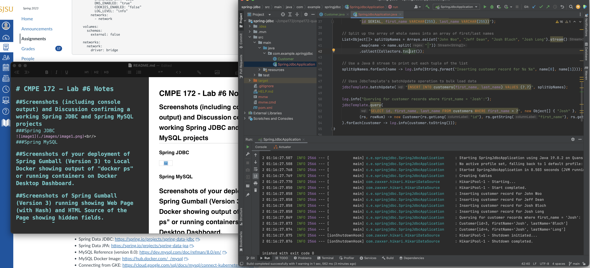
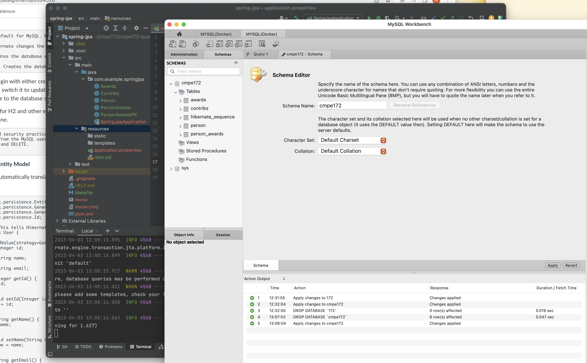
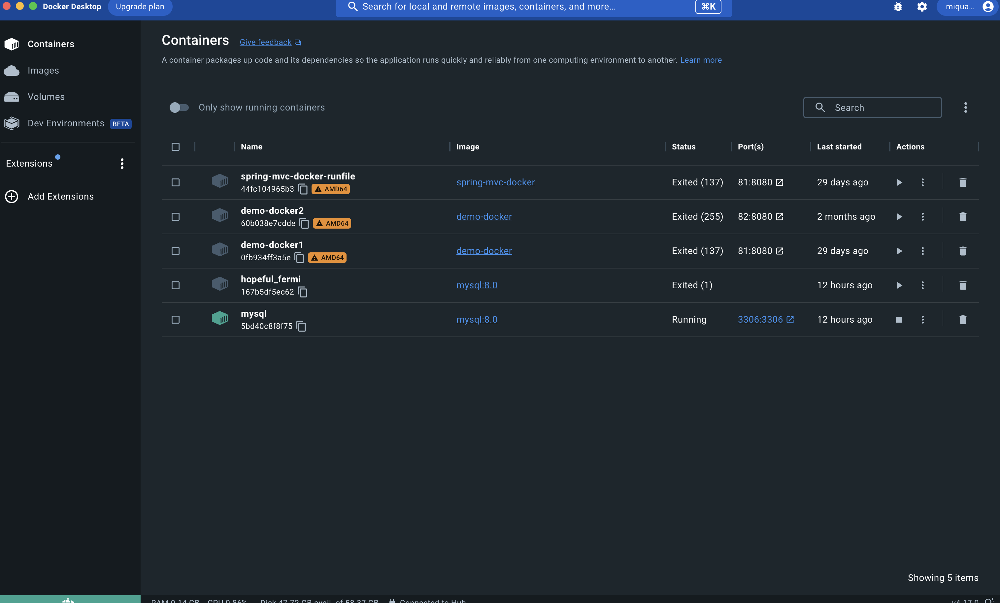
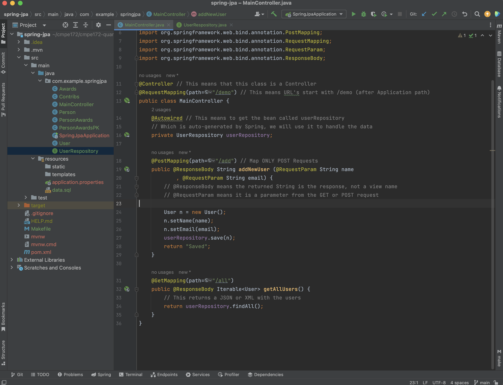
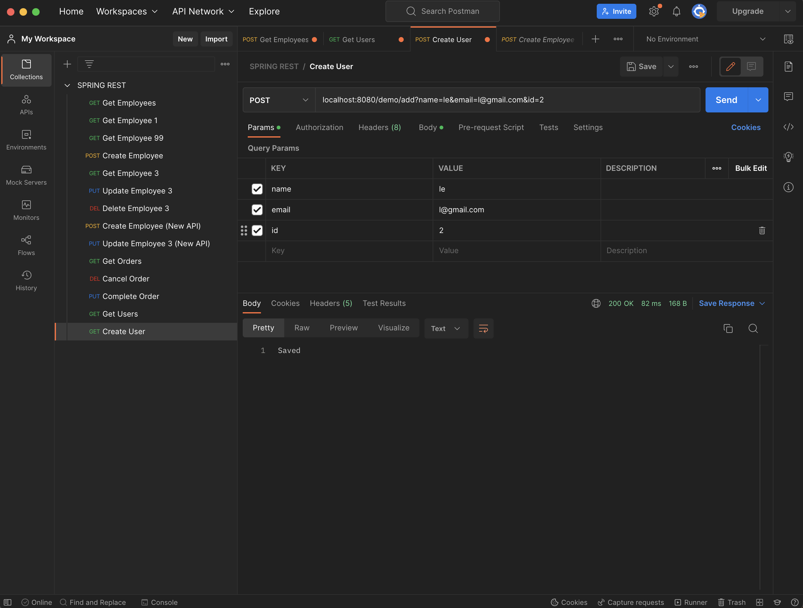
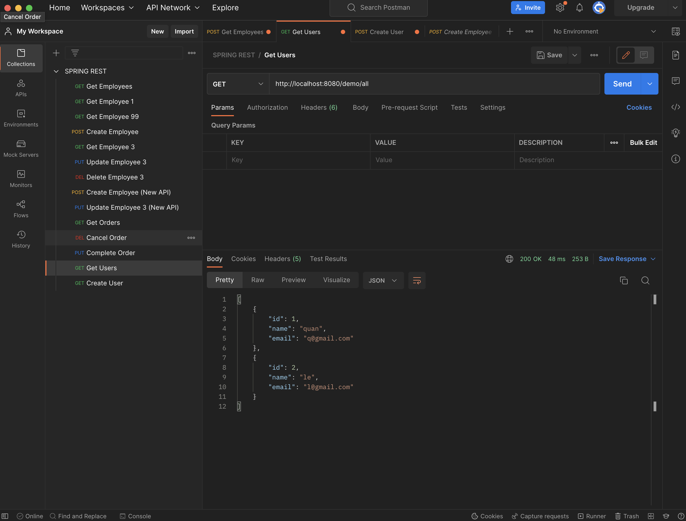
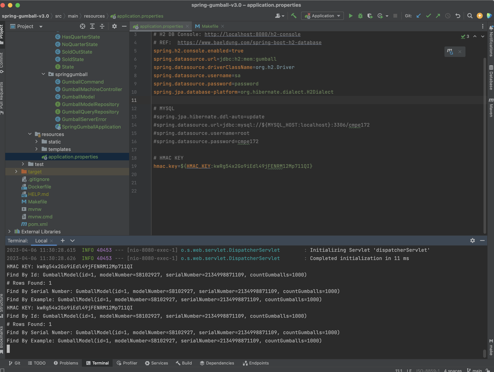
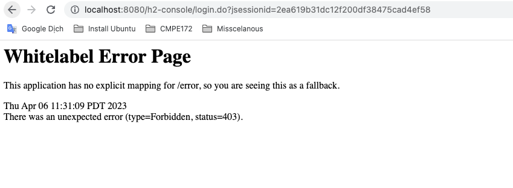
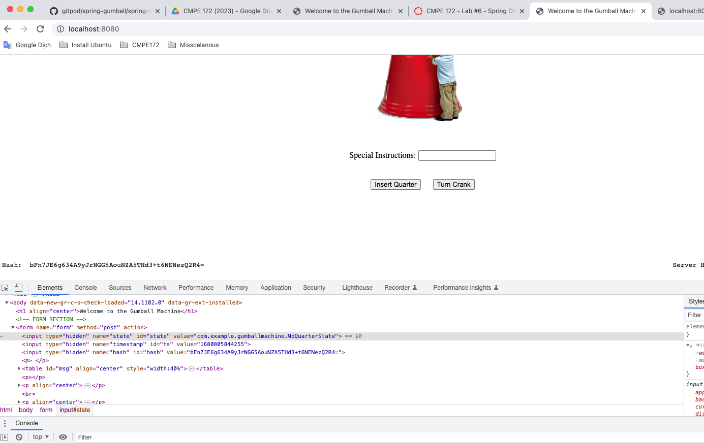

# CMPE 172 - Lab #6 Notes

## Screenshots (including console output) and Discussion confirming a working Spring JDBC and Spring MySQL projects
### Spring JDBC
 
They manually insert data in the sql.
### Spring MySQL
 
 
 
 
 
 
 
They automatically map the tables to the schema in MySQLWorkBench

##Screenshots of your deployment of Spring Gumball (Version 3) to Local Docker showing output of "docker ps" or running containers on Docker Desktop Dashboard.
 
 
##Screenshots of Spring Gumball (Version 3) running showing Web Page (with Hash) and HTML Source of the Page showing hidden fields.
 